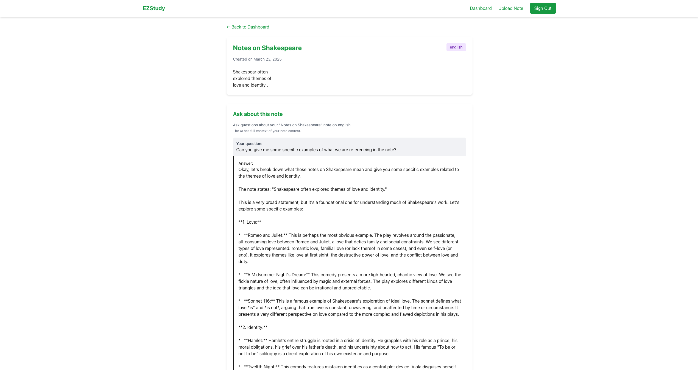

# EZStudy - Transcribe and Organize Handwritten Notes 

EZStudy is a Next.js application that allows users to upload images of their handwritten notes, have them transcribed into text, and organize them by subject. The application uses Supabase for authentication and data storage, integrates with a AWS Textract for OCR text extraction, and uses a custom Google Gemini LLM for our chatbot. PLEASE NOTE: the chatbot and OCR are being hosted on the free tier of render, this means that after a period of inactivity the server "goes to sleep" so transcribing an image or using the chatbot might take a minute to load initially (you might even have to refresh the page). Also Textract and Gemini are running on free tokens (thank you AWS and GCS!), which means the OCR and chatbot features may not be working when you are visiting the site, but I have screenshots of these features in case they are not working anymore.

## Live Demo

Check out the live application: [EZStudy](https://idontwantto.study/auth/login)

!!!Your confirmation email from supabase to confirm account registration might be sent to your spam.

## Features

- **User Authentication**: Sign up, login, and account management using Supabase Auth
- **Note Upload & Transcription**: Upload images of handwritten notes and convert them to text
- **Note Organization**: Categorize notes by subject (math, science, history, or english)
- **Responsive Design**: Responsive UI using TailwindCSS with a green and white theme
- **Chatbot for your notes**: Talk to our custom trained chatbot about your notes

## Tech Stack

- **Frontend/Backend**: Next.js with App Router
- **Styling**: TailwindCSS
- **Authentication & Database**: Supabase
- **Image Processing**: AWS Textract (hosted on a flask server) for OCR (Optical Character Recognition)

