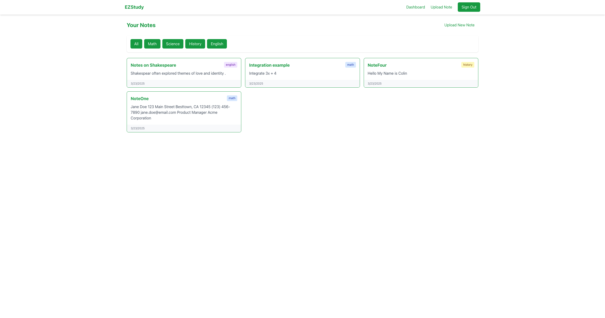

# EZStudy - Transcribe and Organize Handwritten Notes 

EZStudy is a Next.js application that allows users to upload images of their handwritten notes, have them transcribed into text, and organize them by subject. The application uses Supabase for authentication and data storage, and integrates with a Flask API for OCR text extraction. PLEASE NOTE, the chatbot and OCR are being hosted on the free tier of render, this means that after a period of inactivity the server "goes to sleep" so transcribing an image or using the chatbot might take a minute to load initially, or you might need to refresh the page.

## Live Demo

Check out the live application: [EZStudy](https://idontwantto.study/auth/login)

## Features

- **User Authentication**: Sign up, login, and account management using Supabase Auth
- **Note Upload & Transcription**: Upload images of handwritten notes and convert them to text
- **Note Organization**: Categorize notes by subject (math, science, history, or english)
- **Note Management**: View, organize, and access your notes from any device
- **Responsive Design**: Fully responsive UI using TailwindCSS with a green and white theme

## Tech Stack

- **Frontend/Backend**: Next.js with App Router
- **Styling**: TailwindCSS
- **Authentication & Database**: Supabase
- **Image Processing**: Flask API for OCR (Optical Character Recognition)

